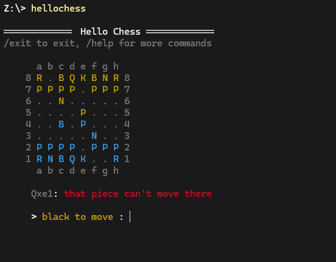

# Chess

An implementation of chess with an ascii terminal frontend.
Supports pass and play, and peer to peer networking.
Run `hellochess --help` for CLI details.

there's also a work in progress fullscreen mode with cli option `--fullscreen`

## Building

Building requires [git](https://git-scm.com) and the latest master build of [zig](https://ziglang.org/download/).
Consider using a zig version manager like [zigup](https://github.com/marler8997/zigup) for
easier updating and/or version swapping.

 1. clone with `git clone --recursive https://github.com/PatrickTorgerson/hellochess.git`
 1. in the root project directory run `zig build`
 1. resulting exe can be found at `./zig-out/bin/hellochess.exe`

## Planned Features (in no particular order)
 * AI opponent
 * UCI frontend
 * Game analysis
 * save/load games as PGN
 * Fullscreen mode with mouse input
 * linux support

## License
---
> MIT License
>
> Copyright (c) 2023 Patrick Torgerson
>
> Permission is hereby granted, free of charge, to any person obtaining a copy
> of this software and associated documentation files (the "Software"), to deal
> in the Software without restriction, including without limitation the rights
> to use, copy, modify, merge, publish, distribute, sublicense, and/or sell
> copies of the Software, and to permit persons to whom the Software is
> furnished to do so, subject to the following conditions:
>
> The above copyright notice and this permission notice shall be included in all
> copies or substantial portions of the Software.
>
> THE SOFTWARE IS PROVIDED "AS IS", WITHOUT WARRANTY OF ANY KIND, EXPRESS OR
> IMPLIED, INCLUDING BUT NOT LIMITED TO THE WARRANTIES OF MERCHANTABILITY,
> FITNESS FOR A PARTICULAR PURPOSE AND NONINFRINGEMENT. IN NO EVENT SHALL THE
> AUTHORS OR COPYRIGHT HOLDERS BE LIABLE FOR ANY CLAIM, DAMAGES OR OTHER
> LIABILITY, WHETHER IN AN ACTION OF CONTRACT, TORT OR OTHERWISE, ARISING FROM,
> OUT OF OR IN CONNECTION WITH THE SOFTWARE OR THE USE OR OTHER DEALINGS IN THE
> SOFTWARE.
